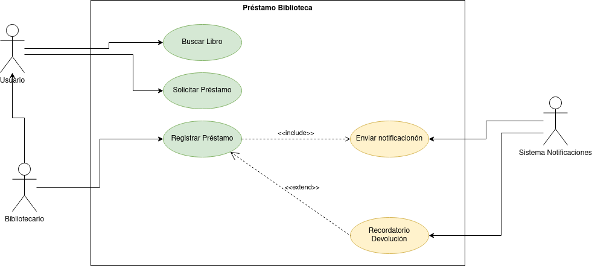

# diagrama
# Proyecto
## Especificación

### Actores
#### Usuario
|  Actor | Usuario |
|---|---|
| Descripción  | _Usuario comun de la biblioteca_  |
| Características  | __ |
| Relaciones | __  |
| Referencias | _Buscar libro, Solicitar prestamo_ |   
|  Notas |  __ |
| Autor  | _Alejandro Salazar Gonzalez_ |
|Fecha | _29/10/2024_ |

|  Atributo |||
|---|---|---|
| _Nombre_  | _Descripción_  | _Tipo_ |
| | |
#### Bibliotecario
|  Actor | Bibliotecario |
|---|---|
| Descripción  | _Bibliotecario de la biblioteca_  |
| Características  | _El bibliotecario realiza las mismas acciones que el usuario y las especificas_ |
| Relaciones | _Registrar prestamo_  |
| Referencias | _Buscar libro, Solicitar prestamo, registrar prestamo_ |   
|  Notas |  __ |
| Autor  | _Alejandro Salazar Gonzalez_ |
|Fecha | _29/10/2024_ |

|  Atributo |||
|---|---|---|
| _Nombre_  | _Descripción_  | _Tipo_ |
| | |
#### Sistema
|  Actor | _Sistema de notificacion_ |
|---|---|
| Descripción  | _Sistema de notificacion de la biblioteca de la biblioteca_  |
| Características  | __ |
| Relaciones | _Enviar notificacion, Recordar devolución_  |
| Referencias | __ |   
|  Notas |  __ |
| Autor  | _Alejandro Salazar Gonzalez_ |
|Fecha | _29/10/2024_ |

|  Atributo |||
|---|---|---|
| _Nombre_  | _Descripción_  | _Tipo_ |
| | |
### Casos de uso
#### Buscar libro
  |  Caso de Uso	CU | Buscar Libro  |
  |---|---|
  | Fuentes  | _Este caso de uso de sustena gracias al [documento]()_  |
  | Actor  |  _Usuario, Bibliotecario_ |
  | Descripción | _Descripción del caso de uso_  |
  | Flujo básico | _Descripción paso a paso de la ejecución. (1->2->3.)_ |
  | Pre-condiciones | _Que debe ocurrir con anterioridad_  |  
  | Post-condiciones  | _Que debe ocurrir con posterioridad_  |  
  |  Requerimientos | _Que debe de exister para que el caso de uso se ejecute. Ej: Tarjeta de crédito_  |
  |  Notas |  _Notas adicionales_ |
  | Autor  | _Quien desarrolla la especificación del actor_ |
  |Fecha | _Fecha de la especificación_ |